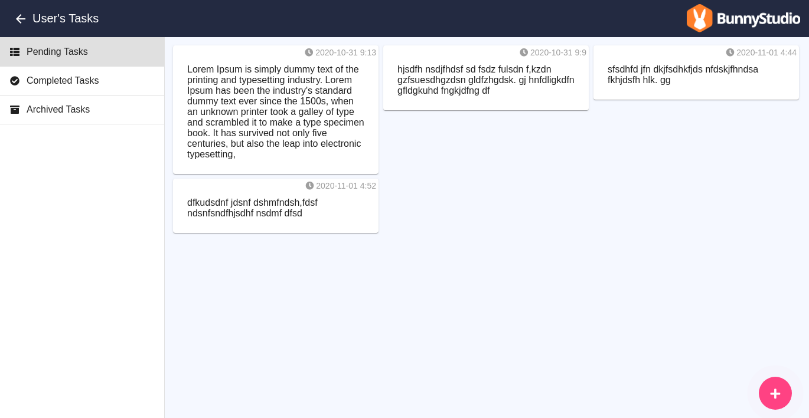
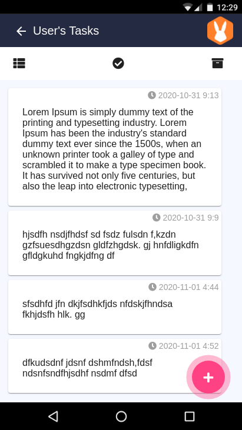
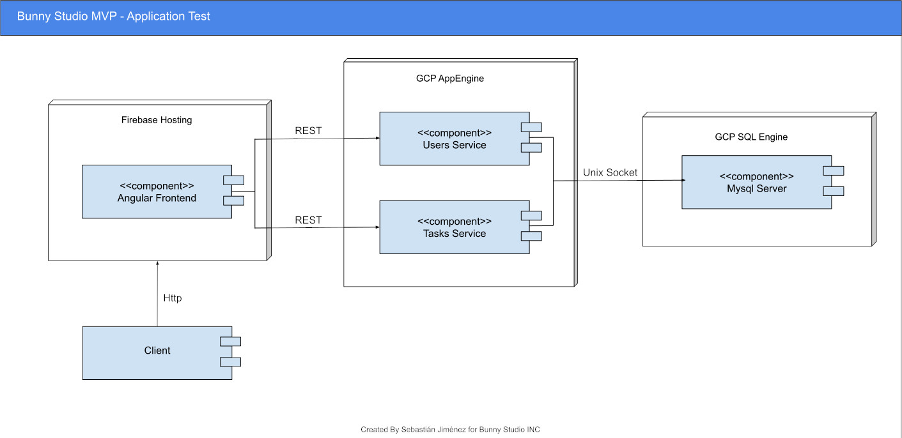

# BunnyStudio MVP

welcome to the BunnyStudio MVP application test
It is composed of a front application in Angular 10 and 2 microservices in NodeJS 12 with mysql/mariadb

[Live application DEMO](https://bunnystudiomvp.web.app)

## snapshots

### Desktop view



### Mobile view



### Software Architecture Diagram


## Backend setup

### Users service setup
execute the mysql scripts in users-service/app/database/migrations in your database to populate it

go to the users-service directory and copy the file .env.example into a .env and configure db connection, you can use port or unix socket connection

``` 
cd users-service
cp .env.example .env
```

Install project dependencies, you can use npm or yarn

``` 
npm install
```

Run service, you can use npm or yarn

``` 
npm run start
```

### Tasks service setup

execute the mysql scripts in tasks-service/app/database/migrations in your database to populate it

go to the tasks-service directory and copy the file .env.example into a .env and configure db connection, you can use port or unix socket connection

``` 
cd users-service
cp .env.example .env
```

Install project dependencies, you can use npm or yarn

``` 
npm install
```

Run service, you can use npm or yarn

``` 
npm run start
```

## Frontend setup

go to the frontend directory and install all js dependencies

``` 
cd frontend
cp npm install
```

Run service with the angular 10 cli, you can use the -o parameter to open browser automatically

``` 
ng serve -o
```
